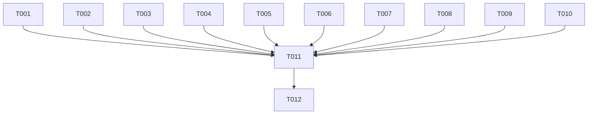

# Tasks: Streamlit Layout Width Deprecation Migration

**Input**: Design documents from `/specs/016-replace-use-container-width/`

**Prerequisites**: plan.md (required), spec.md (required), research.md, quickstart.md

**Organization**: Tasks are organized to ensure safe, file-by-file refactoring and verification of Streamlit's layout parameters.

## Format: `[ID] [P?] [Story] Description`

- **[P]**: Can run in parallel (different files, no dependencies)
- **[Story]**: Which user story this task belongs to (e.g., US1)
- Include exact file paths in descriptions

## Phase 1: Setup

**Purpose**: Task verification setup

- [x] T001 Verify active git branch is `016-replace-use-container-width`

---

## Phase 2: Foundational

**Purpose**: Core prerequisites (none required for this migration)

---

## Phase 3: User Story 1 - Prevent Deprecation Crashes and Maintain Layout Alignment (Priority: P1)

**Goal**: Replace all occurrences of `use_container_width=True` with `width='stretch'` to satisfy Streamlit's API deprecation requirements.

**Independent Test**: Verify layout width configuration in all pages and ensure zero deprecation warnings exist.

### Implementation for User Story 1

- [x] T002 [P] [US1] Replace `use_container_width=True` with `width='stretch'` in `app.py`
- [x] T003 [P] [US1] Replace `use_container_width=True` with `width='stretch'` in `pages/0_dashboard.py`
- [x] T004 [P] [US1] Replace `use_container_width=True` with `width='stretch'` in `pages/1_inventory_adjustment.py`
- [x] T005 [P] [US1] Replace `use_container_width=True` with `width='stretch'` in `pages/2_sales_extraction.py`
- [x] T006 [P] [US1] Replace `use_container_width=True` with `width='stretch'` in `pages/3_promotion_comparison.py`
- [x] T007 [P] [US1] Replace `use_container_width=True` with `width='stretch'` in `pages/4_stock_mutation.py`
- [x] T008 [P] [US1] Replace `use_container_width=True` with `width='stretch'` in `pages/5_clearance_stock.py`
- [x] T009 [P] [US1] Replace `use_container_width=True` with `width='stretch'` in `pages/6_initial_stock.py`
- [x] T010 [P] [US1] Replace `use_container_width=True` with `width='stretch'` in `playwright_engine.py`

---

## Phase 4: Polish & Cross-Cutting Concerns

**Purpose**: Verification and documentation updates

- [x] T011 Run streamlit app locally and manually verify that all pages, tables, images, and buttons render warning-free with correct layouts (depends on T002, T003, T004, T005, T006, T007, T008, T009, T010)
- [x] T012 Update `CHANGELOG.md` with user-facing bug fixes and feature improvements (depends on T011)

---

## Dependencies & Execution Order

### Execution Wave DAG

- **Wave 1 (Parallel Implementations)**: T001, T002, T003, T004, T005, T006, T007, T008, T009, T010
- **Wave 2 (Verification)**: T011
- **Wave 3 (Documentation)**: T012

### Implementation Strategy

1. Complete T001 (Setup).
2. Execute Wave 1 implementation tasks in parallel or sequence.
3. Perform Wave 2 verification.
4. Update release documentation in Wave 3.
